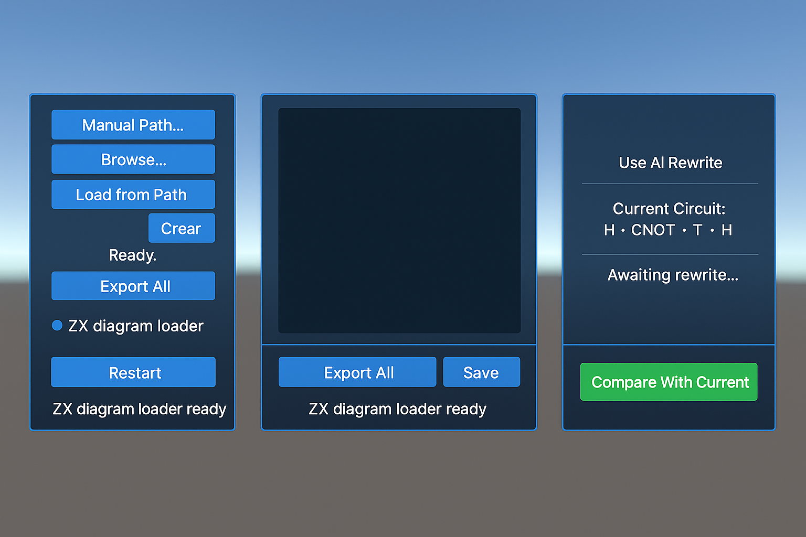
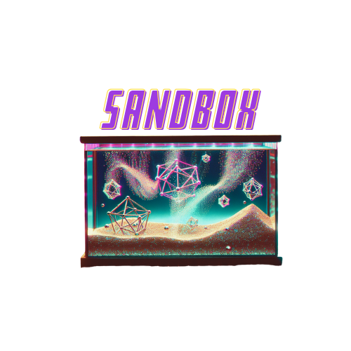

# 🧠 SandBox — Quantum Computing UI Playground

**SandBox** is a Unity-based modular simulator for visualizing and experimenting with quantum computing structures in real time. It includes support for:

- 🧩 **ZX-calculus** diagrams (load, display, export)
- 🔍 **Quantum kernel visualizations** with noise effects and delta maps
- 🧠 **AI-assisted ZX rewriting** (partially implemented)
- 🧪 **Quantum error correction** lattice support (included but experimental)
- 📸 **Snapshot timeline** with kernel/ZX state history and export

---

## 🎮 Runtime UI (No Inspector Setup Required)

All UI panels are instantiated dynamically via `SceneStartup.cs`. Just open the scene and press Play.

- **Kernel Loader Panel** (left)
- **ZX Diagram Panel** (center)
- **ZX Rewriter Panel** (right)
- **Snapshot Timeline Panel** (bottom)

---

## 📦 Project Structure

```
SandBox/
├── Assets/
│   ├── Scripts/                      # All logic scripts
│   ├── Resources/                   # Styled UI prefabs
│   └── Scenes/
│       └── SceneStartup.unity      # Main entry point
├── README.md
├── LICENSE
└── preview.png                     # UI preview screenshot (attached)
```

---

## ✅ Features Implemented

- Dynamic panel instantiation (no prefab linking required)
- Kernel matrix heatmaps with import + snapshot
- ZX diagram loader, viewer, and export
- Snapshot system with labeled timeline
- Basic UI styling (center-wide layout, aligned panels)
- QEC lattice (runtime-enabled but not fully interactive yet)
- ZX Rewriter logic (AI toggle, UI working; backend in progress)

---

## 🛠️ Planned Enhancements

- [ ] ZX Rewrite AI suggestion engine
- [ ] ZX Rule History + visual rewrite tree
- [ ] QEC auto-correction + syndrome marker overlays
- [ ] Kernel fidelity scoring (signal vs background)
- [ ] Unity `.unitypackage` export for plug-and-play deployment

---

## 📸 Preview



---

## 🐠 Logo



---

## 🔧 How to Launch

1. Open `SceneStartup.unity` in Unity 2022.3+
2. Hit **Play**
3. UI auto-builds on start — no manual setup required

---

## 📄 License

MIT License for academic/non-commercial use.
For commercial licensing, contact the project author.

---

**Developed for experimental research and educational sandboxing of quantum computing principles.**
